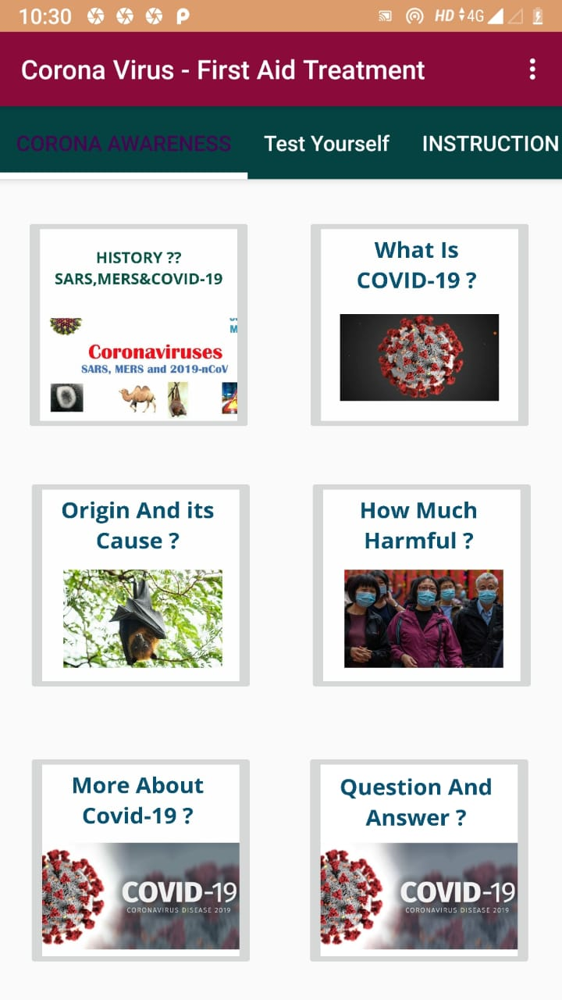
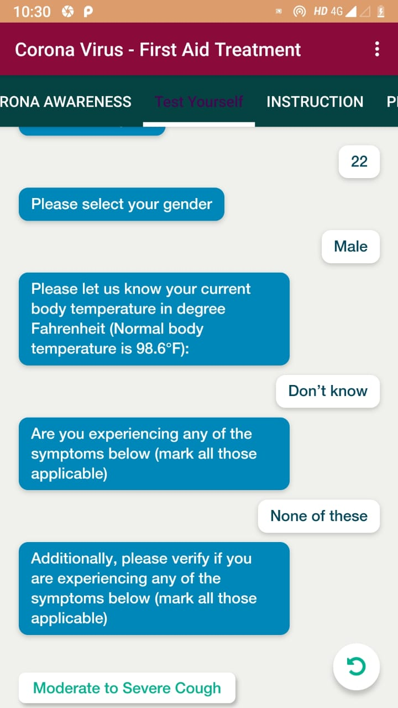
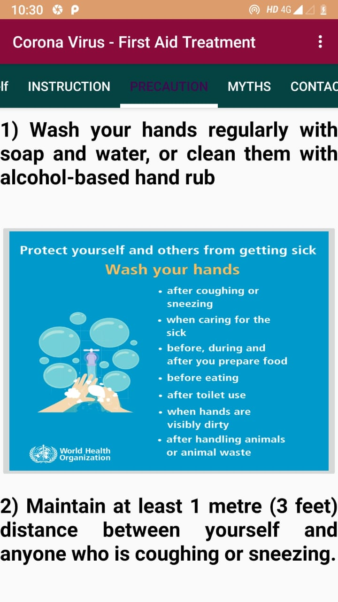
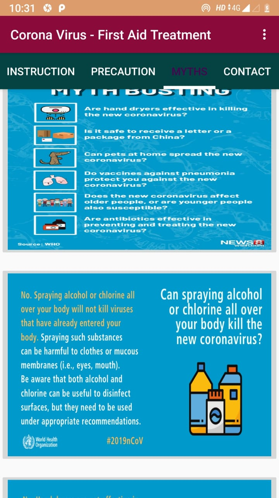
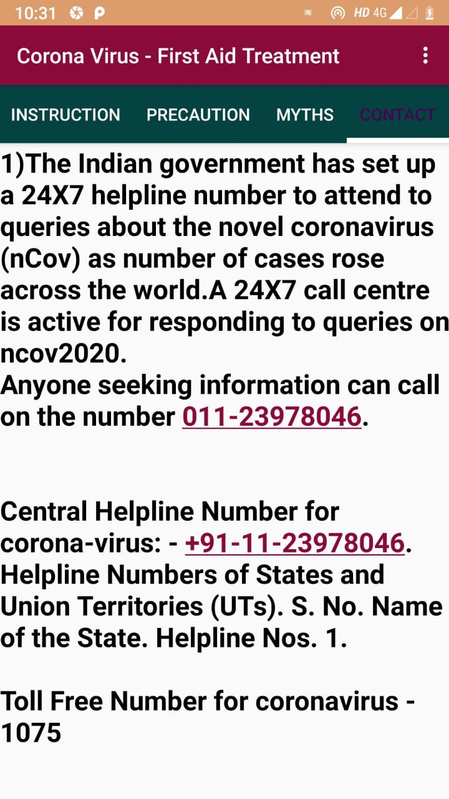
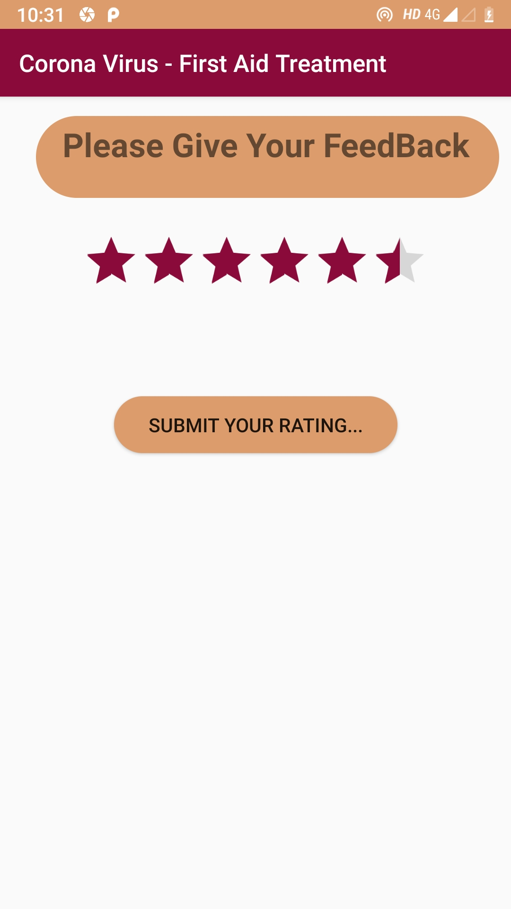

# Covid19_SelfAssesment
This is Android Application with a Beautiful and user Friendly UI/UX . In this Application User will get Information regarding Corona virus, There is a self assesment feature which ask several question regarding their current position and tells the result and guide them to protect from this epidemic >this Application has many more features.  

